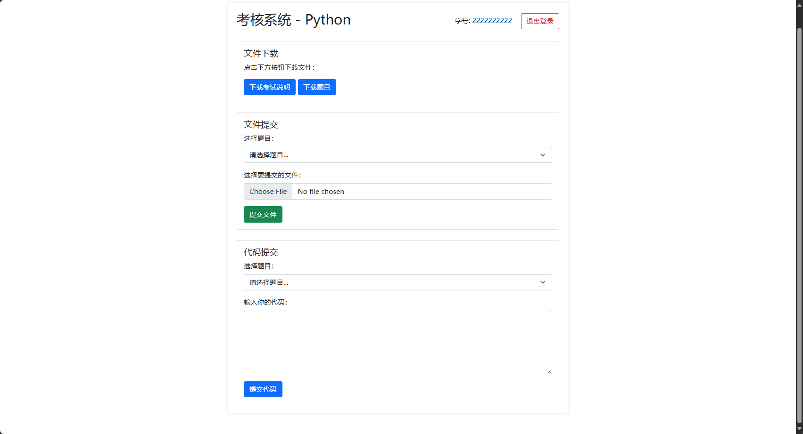

# 在线评测系统

基于 FastAPI 的在线代码测试系统。

## 功能特性

- [x] 用户认证
- [x] 题目列表
- [x] 代码提交
- [ ] 自动评测
- [ ] 排行榜
- [ ] 前端样式

## 开始使用

### 安装依赖

```bash
pip install -r requirements.txt
```

### 运行应用

```bash
uvicorn main:app --host 0.0.0.0 --port your_port --reload
```

## 项目结构

```raw
fastapi-oj/
├── .gitignore
├── main.py                  # 主应用入口
├── config.py                # 配置文件
├── data.csv                 # 数据文件
├── requirements.txt         # 项目依赖
├── assets/                  # 源图片
    ├── login.png
    ├── home.png
├── templates/
│   ├── login.html           # 登录页面
│   ├── home.html            # 主页面
└── utils/
    ├── judge.py             # 代码执行和评测
    └── parse.py             # 代码解析工具及其他
```

## 其他

> 这个项目的初衷是为了实验室招新，在技术选型上需要考虑的是下一届成员的接手与维护，因此尽可能上手简单，还要保证系统具有一定的性能。
> 开发语言因此选择了Python。比对了很多Python全栈和后端的框架如Streamlit、Taipy、Dash、Flask等，最后选择了FastAPI。
> 每次使用的人数不会很多，所以目前没打算用数据库。

## 界面展示

### 登录页面


### 主页面


