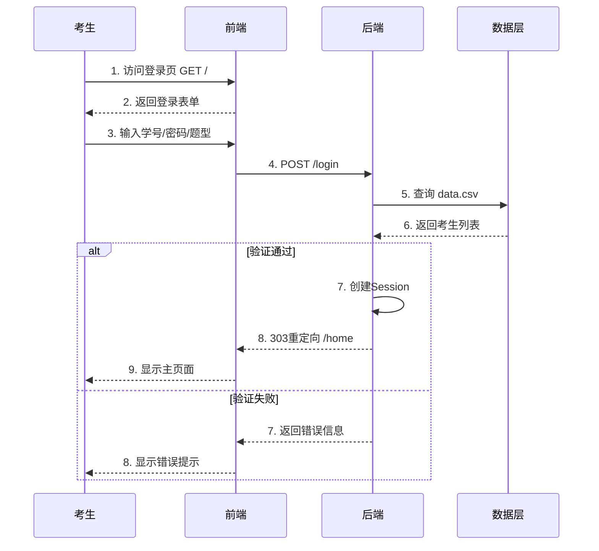
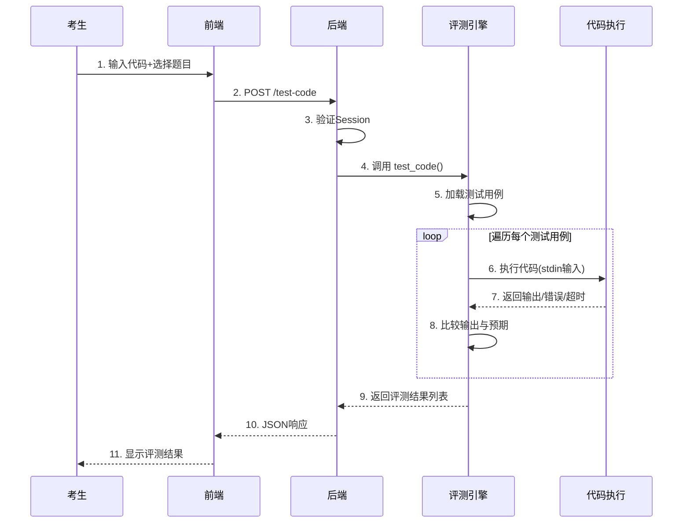
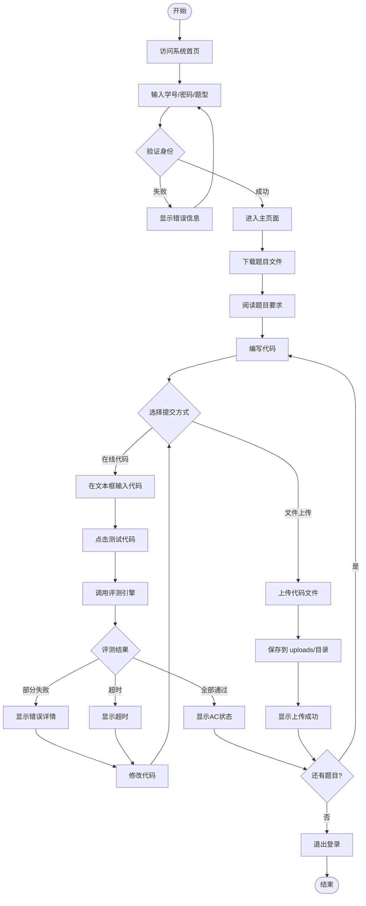
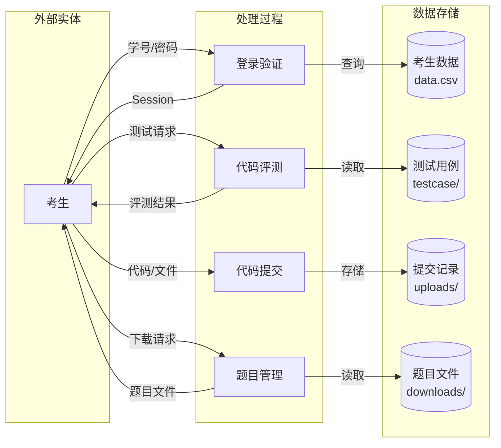

# 在线评测系统 - 架构与工作流

## 一、系统架构

技术栈
```
前端: Jinja2模板 + Bootstrap 5 + Font Awesome
后端: FastAPI + Starlette Session
数据: CSV文件 (无数据库)
执行: subprocess (Python/GCC)
```

### 核心模块

| 模块 | 文件 | 职责 |
|------|------|------|
| 路由层 | `main.py` | 8个API端点，处理所有HTTP请求 |
| 配置层 | `config.py` | 考生数据、目录路径、题型定义 |
| 评测引擎 | `utils/judge.py` | Python/C代码执行与结果比对 |
| 测试用例 | `testcase/` | JSON格式题目和测试数据 |
| 前端模板 | `templates/` | 登录页+主页，表单提交 |


### 工作流概览

```
考生登录 → 身份验证 → 进入主页
                ↓
        ┌───────┴───────┐
        ↓               ↓
    下载题目         上传代码
        ↓               ↓
    阅读题目      ┌──────┴──────┐
        ↓         ↓             ↓
    编写代码   文件上传      在线测试
        ↓         ↓             ↓
        └────→ 保存到       评测引擎
               uploads/         ↓
                          执行+比对结果
```


## 二、用户登录时序图



## 三、代码评测时序图



## 四、完整考试流程图



## 五、数据流图



## 六、目录结构与文件映射

```
fastapi-oj/
├── main.py                  # 主应用入口 (路由定义)
│   ├── GET  /               # 登录页面
│   ├── POST /login          # 登录验证
│   ├── GET  /home           # 主页面
│   ├── GET  /download/{file}# 文件下载
│   ├── POST /upload-file    # 文件上传
│   ├── POST /upload-code    # 代码上传
│   ├── POST /test-code      # 代码评测
│   └── GET  /logout         # 退出登录
│
├── config.py                # 配置文件
│   ├── UPLOAD_DIR           # 上传目录: "uploads"
│   ├── DOWNLOAD_DIR         # 下载目录: "downloads"
│   ├── roles                # 题型: ["Python", "C", "MCU"]
│   ├── data                 # 考生数据 (pandas)
│   ├── ids                  # 考生ID集合
│   ├── prefix               # 学号前缀: "2"
│   └── size                 # 学号长度: 10
│
├── utils/
│   └── judge.py             # 评测引擎
│       ├── run_python_code()# Python代码执行
│       ├── run_c_code()     # C代码编译执行
│       └── test_code()      # 多测试用例评测
│
├── testcase/
│   ├── __init__.py          # 加载测试用例
│   ├── C.json               # C语言测试用例
│   └── Python.json          # Python测试用例
│
├── templates/
│   ├── login.html           # 登录页面模板
│   └── home.html            # 主页面模板
│
├── data.csv                 # 考生数据 (学号列表)
│
├── uploads/                 # 考生提交目录 (运行时创建)
│   ├── Python/
│   │   └── {id[3:7]}/
│   │       └── {id[7:]}/
│   │           ├── A.py
│   │           ├── B.py
│   │           └── Python_code.txt
│   ├── C/
│   └── MCU/
│
└── downloads/               # 题目文件目录 (需手动创建)
    ├── instruction.pdf      # 考试说明
    ├── Python.zip           # Python题目
    ├── C.zip                # C题目
    └── MCU.zip              # MCU题目
```

## 七、核心数据结构

### 测试用例格式 (testcase/*.json)
```json
{
    "name": "Python",
    "questions": {
        "A": {
            "name": "题目名称",
            "description": "题目描述",
            "test_cases": [
                {
                    "input": "输入数据",
                    "expected": "期望输出",
                    "time_limit": 1.0
                }
            ]
        }
    }
}
```

### 评测结果格式
```json
{
    "status": "success",
    "results": [
        {
            "test_case": 1,
            "status": "Passed|Failed|Time Limit Exceeded|Error",
            "message": "详细信息",
            "time": 0.123
        }
    ],
    "question_name": "题目名称"
}
```

### 文件上传路径规则
```
uploads/{role}/{id[3:7]}/{id[7:]}/{question}{extension}

示例:
uploads/Python/2222/2222/A.py
uploads/C/2222/2222/B.c
```
